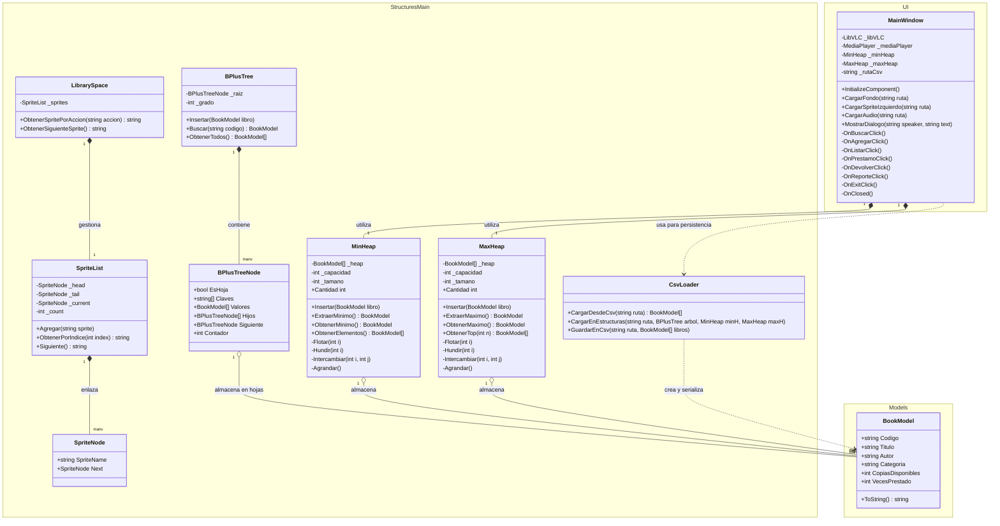

# DIAGRAMAS Y REVISIÓN DE CUMPLIMIENTO - PROYECTO 1: BIBLIOTECA ARCANA
**Asignatura:** Estructura de Datos II  
**Lenguaje:** C# (.NET 10.0 / Avalonia UI)  

---

## 1. DIAGRAMA DE CLASES (UML)



---

## 2. DIAGRAMA DE FLUJO DEL SISTEMA

```mermaid
flowchart TD
    Start([Inicio de la Aplicación]) --> InitAudio[Inicializar LibVLC\nVolumen al 25%]
    InitAudio --> LoadBg[Cargar Fondo e Interfaz VN]
    LoadBg --> AutoLoad[Buscar Data/book_packets.csv]
    
    AutoLoad --> Exists{¿Existe el CSV?}
    Exists -- Sí --> ParseCSV[CsvLoader: Leer líneas e instanciar BookModel[]]
    ParseCSV --> Populate[Insertar en BPlusTree, MinHeap y MaxHeap]
    Exists -- No --> Welcome[Mostrar Bienvenida con Chihiro Fujisaki]
    Populate --> Welcome

    Welcome --> Menu{Esperar Acción del Usuario\n(Sidebar Panel)}

    Menu -- 📖 Buscar --> DialogSearch[Abrir DialogBuscar]
    DialogSearch --> SearchExec[Consultar BPlusTree por Código]
    SearchExec --> ShowSearchResult[Mostrar Resultado en Diálogo] --> Menu

    Menu -- ➕ Agregar --> DialogAdd[Abrir DialogAgregar]
    DialogAdd --> AddExec[Instanciar nuevo BookModel\nInsertar en BPlusTree, MinHeap y MaxHeap]
    AddExec --> SaveAuto1[Auto-guardar en book_packets.csv] --> Menu

    Menu -- 📋 Listar --> ListExec[Recorrer Hojas Enlazadas del Árbol B+]
    ListExec --> ShowList[Desplegar Catálogo Ordenado] --> Menu

    Menu -- 📚 Préstamo --> DialogLoan[Abrir DialogPrestamo]
    DialogLoan --> LoanExec[Buscar Libro -> Restar CopiaDisponible\nIncrementar VecesPrestado]
    LoanExec --> SaveAuto2[Auto-guardar en book_packets.csv] --> Menu

    Menu -- ↩️ Devolver --> DialogReturn[Abrir DialogDevolver]
    DialogReturn --> ReturnExec[Buscar Libro -> Incrementar CopiaDisponible]
    ReturnExec --> SaveAuto3[Auto-guardar en book_packets.csv] --> Menu

    Menu -- 📊 Reporte --> ReportExec[Ejecutar MaxHeap.ObtenerTop5]
    ReportExec --> ShowReport[Desplegar Top 5 Libros Más Prestados] --> Menu

    Menu -- 🚪 Salir / Cerrar --> SaveFinal[CsvLoader.GuardarEnCsv en Data/book_packets.csv]
    SaveFinal --> DisposeAudio[Liberar LibVLC & MediaPlayer]
    DisposeAudio --> End([Fin del Programa])
```

---

## 3. AUDITORÍA DE CUMPLIMIENTO CON EL PDF (PROYECTO 1)

| Requisito Técnico del PDF | Estado | Evidencia en el Código |
| :--- | :---: | :--- |
| **1. Estructuras Obligatorias** | 🟢 Cumplido | • **Árbol B+**: [`ShelvesB+.cs`](file:///home/yv/YV/Landivar/cuarto_semestre/EDD_II/FirstProject/LibraryX/StructuresMain/ShelvesB+.cs)<br>• **Min Heap**: [`MinH.cs`](file:///home/yv/YV/Landivar/cuarto_semestre/EDD_II/FirstProject/LibraryX/StructuresMain/MinH.cs) ordenado por `CopiasDisponibles`<br>• **Max Heap**: [`MaxH.cs`](file:///home/yv/YV/Landivar/cuarto_semestre/EDD_II/FirstProject/LibraryX/StructuresMain/MaxH.cs) ordenado por `VecesPrestado` |
| **2. Operaciones Básicas** | 🟢 Cumplido | • Insertar (`Insertar`)<br>• Buscar por clave (`Buscar`)<br>• Recorrido ordenado de hojas (`ObtenerTodos`)<br>• Préstamos y devoluciones (actualización de nodos) |
| **3. Datos Dinámicos** | 🟢 Cumplido | • Carga y guardado automático en CSV (`Data/book_packets.csv`) mediante [`CsvLoader.cs`](file:///home/yv/YV/Landivar/cuarto_semestre/EDD_II/FirstProject/LibraryX/StructuresMain/CsvLoader.cs)<br>• Registro manual interactivo (`DialogAgregar.axaml`) |
| **4. Menú Interactivo** | 🟢 Cumplido | Interfaz gráfica interactiva estilo Visual Novel desarrollada en Avalonia UI (`MainWindow.axaml`) con Chihiro Fujisaki y panel lateral |
| **5. Implementación Propia** *(Sin colecciones prohibidas)* | 🟢 Cumplido | **NO se utiliza `List<T>`, `Dictionary`, `SortedSet` ni `PriorityQueue`**. Las estructuras usan arreglos estáticos primarios (`BookModel[]`, `string[]`) con algoritmos propios de `Flotar`, `Hundir`, `Intercambiar` y `Agrandar` desarrollados desde cero |
